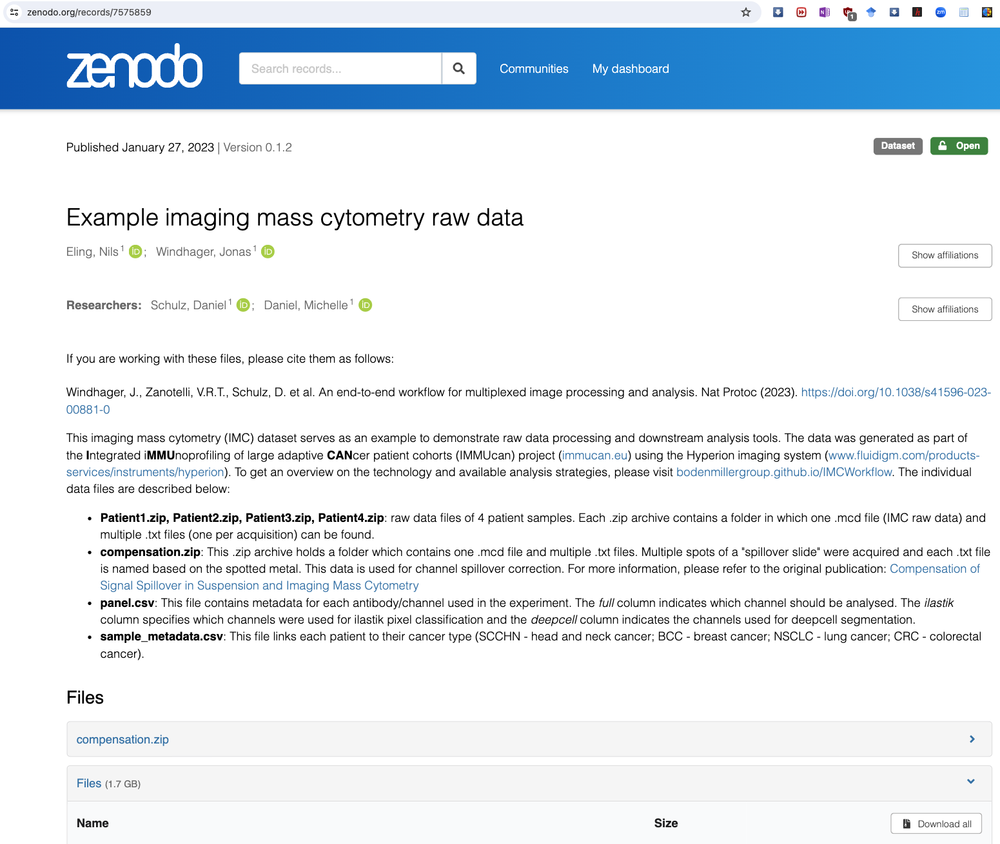

# Lab 4: IMC-example using the [steinbock](https://bodenmillergroup.github.io/steinbock) toolkit

This lab is part of our journey through computational imaging and modeling techniques, and the use of AI in biomedical applications related to Imaging Mass Cytometry (IMC).    _update: 2024-01-30_

<!--   -->
 
If you have a subscription to [ChatGPT Plus](https://openai.com/blog/chatgpt-plus), you can also try out the the [**Medical AI Assistant (UiBmed - ELMED219 & BMED365)**](https://chat.openai.com/g/g-d90dfN17H-medical-ai-assistant-uibmed-elmed219-bmed365) [GPT](https://openai.com/blog/introducing-gpts) and see if you can get it to answer some of your questions.

---------------

## Data

-----

### Video lectures:

- _Uncovering Cellular Networks by Imaging Mass Cytometry_ by [Bernd Bodenmiller](https://scholar.google.com/citations?user=-crrFJYAAAAJ&hl=en), University of Zurich & ETH Zurich [[link](https://youtu.be/j3DSbg-oB8w?si=0PDiQHuHfvlUy26j)] (27:45 min)
   - see also the [Bodenmiller lab](https://www.bodenmillerlab.com) and their GitHub repo (https://github.com/BodenmillerGroup)

   
### Readings:

- Windhager, J., Zanotelli, V.R.T., Schulz, D. et al.  _An end-to-end workflow for multiplexed image processing and analysis_  Nat Protoc (2023) [[link](https://doi.org/10.1038/s41596-023-00881-0)] 
  
### Repos:

-  _steinbock_  [[link](https://github.com/BodenmillerGroup/steinbock)] A toolkit for processing multiplexed tissue images

<!--
- _100 Days of NLP </>_ by Raviraja Ghanta [[link](https://github.com/graviraja/100-Days-of-NLP)] A visual guide through NLP with Jupyter notebooks (using colab).
-->

