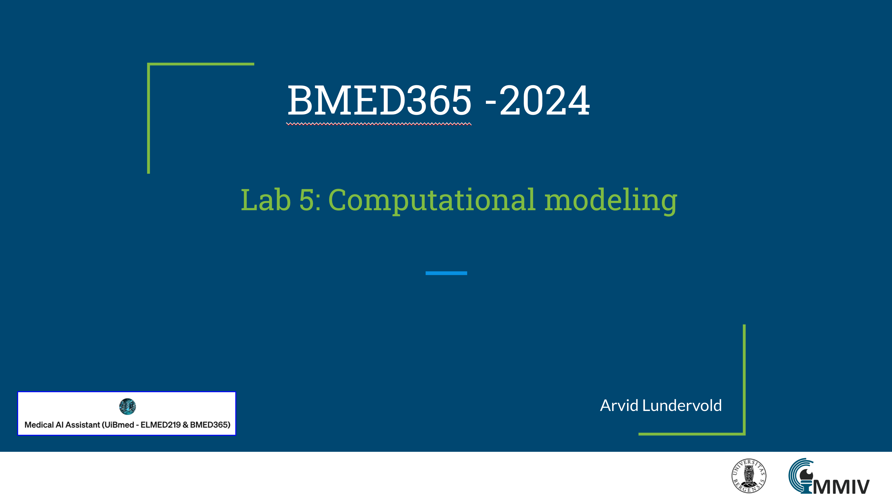

# Lab 5: Computational modeling

This lab is part of our journey through computational imaging and modeling techniques, and the use of AI in biomedical applications. It is designed to give you a comprehensive understanding of how computational imaging is transforming society in general and biomedicine in particular and the role it will play in the future of biomedical research.   _update: 2024-02-15_

<!--   -->
 
If you have a subscription to [ChatGPT Plus](https://openai.com/blog/chatgpt-plus), you can also try out the the [**Medical AI Assistant (UiBmed - ELMED219 & BMED365)**](https://chat.openai.com/g/g-d90dfN17H-medical-ai-assistant-uibmed-elmed219-bmed365) [GPT](https://openai.com/blog/introducing-gpts) and see if you can get it to answer some of your questions.

---------------

## Slides

<!--

-->

------
## Notebooks

| Notebook    |      1-Click Notebook     
|:----------|------|
|  [1-comp-imag.ipynb](https://nbviewer.org/github/MMIV-ML/BMED365/blob/main/Lab4-Comp-Imag/1-comp-imag.ipynb)   Exploration of digital images (micro & macro), image processing, and computational imaging (eg. Gabor filtering)|  

-----

## Learning motivations - watch these
(in the order of duration ...)
