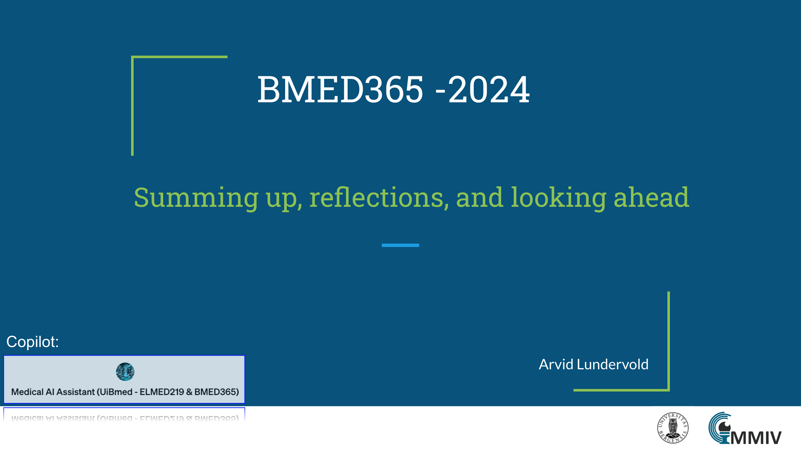

# Summing up, reflections, and looking ahead

 _update: 2024-02-21_

<!--   -->
 
If you have a subscription to [ChatGPT Plus](https://openai.com/blog/chatgpt-plus), you can also try out the the [**Medical AI Assistant (UiBmed - ELMED219 & BMED365)**](https://chat.openai.com/g/g-d90dfN17H-medical-ai-assistant-uibmed-elmed219-bmed365)   [GPT](https://openai.com/blog/introducing-gpts) and see if you can get it to answer some of your questions.

---------------

## Slides

<!--

-->
-----

### Reflections - watch these
(in the order of duration ...)

  
### Readings:
(in the order of most recent ...)

  
### Repos:

----

#### DIGI116 Medical Data Science, UiB  25 Sep. 2023

[UiB DIGI-emner høsten 2023](https://www.uib.no/digi/162588/digi-emner-h%C3%B8sten-2023) - [DIGI116](https://www.uib.no/digi/162588/digi-emner-h%C3%B8sten-2023#digi116-nbsp-medical-data-science)

----

